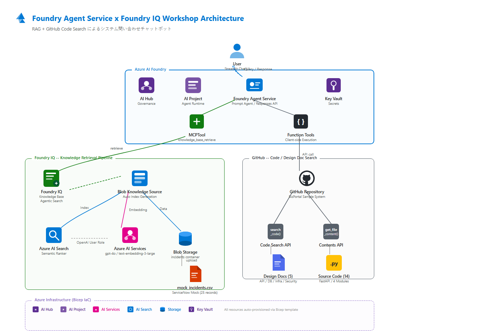

# ハンズオンラボ: Foundry Agent Service × Foundry IQ チャットボット

## 概要

ServiceNow上のインシデント情報（モックCSV）およびGitHub上の設計書・ソースコードから、  
ユーザーからのシステム問い合わせに自動応答するチャットボットを構築するハンズオンラボです。

### 特徴

| コンポーネント | アプローチ |
|---------------|-----------|
| **インシデント情報** | モック CSV → **Blob Storage** → **Blob Knowledge Source** が自動でインデックス化 |
| **ナレッジ検索** | **Foundry IQ KB** → **MCPTool** で Agent Service に接続 |
| **ソースコード・設計書** | **GitHub Function Tools** → Agent Service のツールとしてリアルタイム検索・取得 |
| **エージェント** | **Foundry Agent Service** (Prompt Agent + Responses API) が KB + GitHub ツールを自動選択 |
| **インフラ** | **Bicep テンプレート** で Azure リソースを一括プロビジョニング |
| **KB / Agent セットアップ** | **Python スクリプト** で Knowledge Source / Base / Agent を自動作成 (IaC) |

## アーキテクチャ



### コンポーネント概要

```
ユーザー (Streamlit Chat UI)
         │ 質問
         ▼
Foundry Agent Service (Prompt Agent)
 │
 ├── MCPTool: knowledge_base_retrieve
 │     └─ Foundry IQ Knowledge Base (アジェンティック検索)
 │          └─ Blob Knowledge Source (自動生成)
 │               ├─ Azure AI Search Index (自動)
 │               ├─ Embedding: text-embedding-3-large (自動)
 │               └─ Blob Storage ← モック CSV
 │
 └── Function Tools (クライアント側実行)
       ├─ search_code()       → GitHub Code Search API
       ├─ get_file_content()  → GitHub Contents API
       └─ list_repository_files() → GitHub Trees API
```

### IaC による完全自動化フロー

```
Step 1: Bicep デプロイ
  → AI Hub + AI Project + AI Search + AI Services + Storage + Key Vault + ロール割り当て

Step 2: Knowledge セットアップスクリプト
  → CSV → Blob アップロード → Knowledge Source → Knowledge Base 作成

Step 3: Agent セットアップスクリプト
  → RemoteTool 接続作成 → Prompt Agent 作成 (MCPTool + 指示)

Step 4: アプリ起動
  → streamlit run src/app.py
```

## 前提条件

- Python 3.11+
- Azure サブスクリプション
- GitHub Personal Access Token（対象リポジトリの読み取り権限）

## Azure リソースのデプロイ (Bicep)

```bash
# 1. リソースグループ作成
az group create --name rg-fiqlab --location japaneast

# 2. Bicep テンプレートでデプロイ
az deployment group create \
  --resource-group rg-fiqlab \
  --template-file infra/main.bicep \
  --parameters infra/main.bicepparam

# 3. 出力からエンドポイント・接続文字列を確認
az deployment group show \
  --resource-group rg-fiqlab \
  --name main \
  --query properties.outputs
```

デプロイされるリソース:
- Azure AI Hub + AI Project（Agent Service のホスト）
- Azure AI Search (Basic, Semantic Ranker 有効)
- Azure AI Services (gpt-4o + text-embedding-3-large を統合管理)
- Storage Account + Blob コンテナ (`incidents`)
- Key Vault（AI Hub 依存）
- ロール割り当て (AI Search ↔ Storage, AI Search ↔ AI Services, Project ↔ AI Search)

## クイックスタート

```bash
# 1. ラボディレクトリへ移動
cd handson-lab

# 2. Python 仮想環境を作成
python -m venv .venv
.venv\Scripts\activate      # Windows
# source .venv/bin/activate  # macOS/Linux

# 3. 依存パッケージをインストール
pip install -r requirements.txt

# 4. 環境変数を設定
cp .env.example .env
# .env を編集して各種キー・エンドポイント・接続文字列を設定

# 5. Foundry IQ ナレッジベースを自動セットアップ
python -m scripts.setup_knowledge --wait

# 6. Foundry Agent Service にエージェントを作成
python -m scripts.setup_agent

# 7. チャットアプリを起動
streamlit run src/app.py
```

## モジュール構成

| Module | テーマ | ドキュメント |
|--------|--------|-------------|
| 0 | 環境セットアップ + Bicep デプロイ | [docs/module0-setup.md](docs/module0-setup.md) |
| 1 | モック CSV データ + Blob アップロード | [docs/module1-mock-data.md](docs/module1-mock-data.md) |
| 2 | GitHub Function Tools 構築 | [docs/module2-github-mcp.md](docs/module2-github-mcp.md) |
| 3 | Foundry IQ ナレッジベース構築 (IaC) | [docs/module3-foundry-iq.md](docs/module3-foundry-iq.md) |
| 4 | Foundry Agent Service + UI | [docs/module4-agent-ui.md](docs/module4-agent-ui.md) |
| 5 | 統合テストと品質評価 | [docs/module5-testing.md](docs/module5-testing.md) |

## ファイル構成

```
handson-lab/
├── README.md
├── requirements.txt
├── .env.example
├── data/
│   └── mock_incidents.csv          # ServiceNow モックデータ（25件）
├── infra/
│   ├── main.bicep                  # Azure リソース定義 (IaC)
│   └── main.bicepparam             # パラメータファイル
├── scripts/
│   ├── setup_knowledge.py          # KB 自動セットアップスクリプト
│   └── setup_agent.py              # Agent Service セットアップスクリプト
├── docs/                           # 各モジュールのハンズオン手順書
├── src/
│   ├── config.py                   # 設定管理
│   ├── tools/
│   │   └── github_tools.py         # GitHub Function Tools（API + スキーマ）
│   ├── foundry_iq/
│   │   ├── kb_client.py            # Foundry IQ KB クライアント
│   │   └── kb_query_service.py     # KB 検索サービス（直接利用時）
│   ├── agent/
│   │   └── agent_client.py         # Agent Service クライアント (Responses API)
│   └── app.py                      # Streamlit チャットアプリ
├── notebooks/                      # Jupyter ノートブック（段階的学習用）
└── tests/
    ├── test_foundry_iq.py
    └── test_github_mcp.py
```

## ライセンス

MIT
